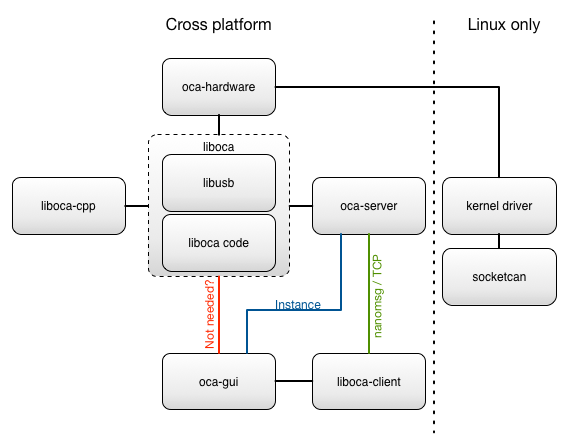

In **Hugo**, pages are the core of your site. Once it is configure, pages are definitely the added value to your documentation site.

## Repos

Organize your site like [any other Hugo project](https://gohugo.io/content/organization/). Typically, you will have a *content* folder with all your pages.

    .
    └── content
        ├── brace
        |   ├── yourselves.md   <- http://example.com/brace/yourselves/
        |   ├── winter
        |   |   └── index.md    <- http://example.com/brace/winter/
        |   └── index.md        <- http://example.com/brace/
        ├── is
        |   ├── coming.md       <- http://example.com/is/comming/
        |   └── index.md        <- http://example.com/is/
        └── ned-stark.md        <- http://example.com/ned-stark/

{}
At that time, **Hugo-theme-learn** supports **only one level** inside a chapter. So you **can't** have http://example.com/chapter1/chapter1.1/page
{}